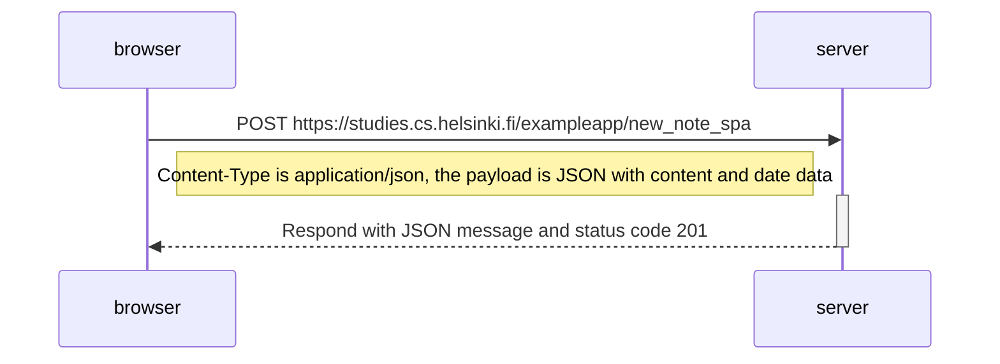

```mermaid
sequenceDiagram
  participant browser
  participant server

  browser->>server: POST https://studies.cs.helsinki.fi/exampleapp/new_note_spa
  Note right of browser: Content-Type is application/json, the payload is JSON with content and date data
  activate server
  server-->>browser: Respond with JSON message and status code 201
  deactivate server
```
